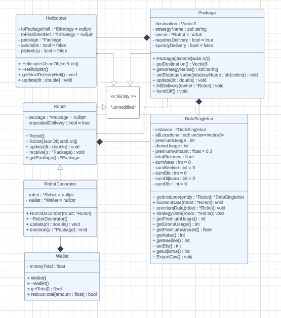

# Team-010-78
# Brady Bannick (banni041), Dan Apodaca (Apoda008), Dante Anand (anand105)
# Project Description:
This project encompasses the ideas of many different design patterns including: Factories, Strategies and Decorators. This project creates many different entities including: drones, packages, helicopters and robots. These entities were all implemented using the abstract factories design pattern allowing for additional IEntities to be created. Each of these entitites has there own specific purpose. In broad terms the drones and helicopters purpose is to deliver packages to the robots. To do this the drones and helicopters use different search strategies to navigate the model. The search strategies were implemented using the strategies design pattern. The project also uses the decorator pattern in a simplistic way. It is used when the drones finish delivering a package. Instead of going directly to the next package, they simply to a celebration and then deliver the next package.
# How do you run the simulation?
In order to run the Simulation you must first make sure you are in the right directory for us it is team-010-78-hw4 then build the project using make all or make -j. Next you call make run in your terminal. Finally you can open the map with http://127.0.0.1:8081 and the schedular with http://127.0.0.1:8081/schedule.html if you are using a different port then change the 8081 in the two links above. You can also access the schedule page by clicking the "schedule page" button on the simulation model. Then after all of that is done you can add packages and robots to the simulation and the drones will handle the delivery.
# What does the simulation do specifically?
The simulation creates a map of the University of Minnesota, and allows the user to create and schedule deliveries on the schedular page.
To schedule a delivery you can create a name for the robot. Then Indicate which search strategy you would like the drone to use.
Next select a point on the map for where the package is and then select a point for where the drone is.
Finally if you click schedule delivery data will be added to the simulation model. Once this is done the drone will beeline
to the package, if it is not already delivering one, and will deliver it to the customer using the indicated search strategy to navigate.
The search strategies that can be picked form include: astar, dfs, bfs, and Dijkstra's.
The simulation model class is where most of this stuff happens. It allows for robots to have packages, which can then be delivered by drones.
Every IEntity has a position variable which allows for other IEntities to navigate to them if they have a some movement ability. 
You can also add human IEntities that roam the map by clicking the add human function.
# New Feature Dual System Delivery:
The dual system delivery now allows for helicopters to deliver packages. Helicopters fly at a faster speed and will always Beeline to the destination making for a quicker delivery. To do this we created a wallet class which randomly assigns a money value inside of it to declare how much money the robot will have. Next we created a robot decorator which wraps the around a robot. We decided to use the decorator desing pattern because it allowed us to give the robot a new ability without changing the existing robot class. The robot decorator has an instance of a robot and a wallet that gets added to the robot. In order for the decorator to work we had to create a json object using the wrapped robots json details, so that we could call the robots constructor. Robot decorator also contains a decision method which randomly decides if the robot will attempt to buy the faster delivery option. It then checks to see if the robot has enough money in its wallet and if it does it buys it, if it doesn't it will just deny the purchase. This is done by adding updating a speedy delivery variable that we added to the package class. Decision takes in a package to be able to update this variable. We next had to update simulation model so that it would create a robot decorator instead of a robot. We also added the decision making in the simulation model class. Finally we updated the helicopter class to give it the ability to deliver packages much like how drone does, but it always uses the beeline strategy. To get a helicopter to deliver packages when its supposed to, both drone and helicopter check the speedy delivery variable of the package. If it is true then the helicopter will pop the package off of the scheduled deliveries vector and start the delivery process. If speedy delivery is false then it will set the package to a nullptr, so that it can't go any further. The drone will be doing the exact same thing except it will deliver the package if speedy delivery is false. We thought that this would be an interesting extension to add because it kind of resembles something like amazon prime where there are ways to speed up the delivery proess if you want your package fast. It also adds to the business logic with the wallet and determining if people are able to afford this delivery system. This extension isn't accessible by the user, but you can see the helicopter and drone decide who should deliver the package in the simulation.
# New Feature Data Analysis:
Our data analysis feature was inplemented using a singleton. This we chose the singleton design pattern, so that everytime we want the data from the simulation we don't have to recreate a new instance of the data and calculate it every single time. This feature saves us lots of time by doing so. The DataSingleton class does basically everything for us. It has a private constructor which is called by the getInstance class just once. It is only called if it has never been called. The constructor returns a DataSingleton pointer which we then set to our instance variable. This is done so that the constructor isn't called everytime someone wants the data. The getInstance method then records the destination for the package or the robots location, the search strategy used to deliver the package, the cost of delivery if premium was used, and the delivery method (helicopter or drone). It then exports to a csv called Singleton.csv. The getInstance method is called in simulation model. We thought this would be an interesting extension to add because it pairs really well with our other extension. It allows us to see how often each delivery method is used and the amount of money that has been made from the premium delivery method. It doesn't add a whole lot to what we have it just uses what we have to record and show data. To use this feature all you have to do is either look at the terminal for the data or you can look in the Singleton.csv file. The order of the data in csv is robot location, total premium used, total revenue, total drone usage, AstarAmount, Beeline, Bfs, Dijkstra, DFS. Scalability would also be very easy with the data singleton because each of the methods are seperate and are very easily able to be added to if necessary.
# Sprint Retrospective:
Our sprints went really well. The first extension we kind of worked on and off for the first 2 or so weeks because it fell right around Thanksgiving and all of us had other classes that we had to prepare for as well. Thus we took longer to do the first extension. For the second extension we did most of our work the last 5 days because all of us had our other classes end before this one, so we were focusing on those. We also did a good job being flexible with each other, and understanding when someone had something else that they needed to do. Some things we had difficulties with was finding a time where we could all work together and talk. Although we were able to get both extensions done a lot of the work was done right at the end of the sprint. We could have possibly spread it out more to make our lives a little less stressful.
# UML Diagram

# Video Explanation of Project
https://youtu.be/h-0iMMPUngs
# Docker Link
https://hub.docker.com/repository/docker/apoda008/homework4/general